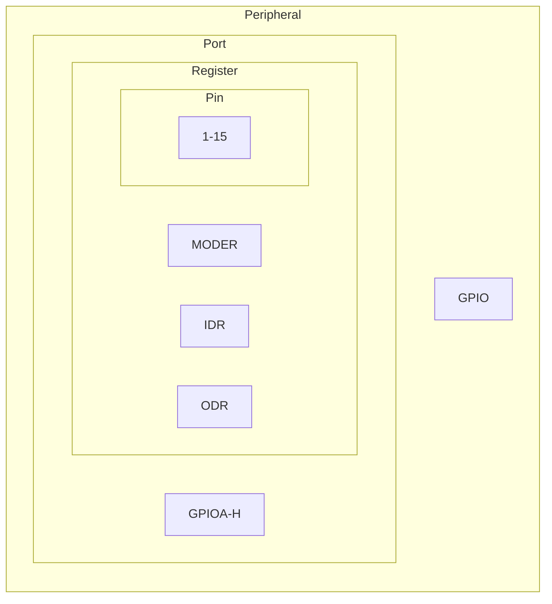

- [Minimal Drivers](#minimal-drivers)
  - [Links](#links)
  - [Microcontrollers layers](#microcontrollers-layers)
  - [Pre-requisites](#pre-requisites)
  - [GPIO](#gpio)

# Minimal Drivers

This code has been tested on

- B-L475-IOT01A board (STM32L475VGT6 ARM Cortex M4 CPU with FPU)

## Links

- [Cargo binutils](https://github.com/rust-embedded/cargo-binutils)
- [Embedded Rust book](https://doc.rust-lang.org/stable/embedded-book/)
- [Lowlevel Embedded Rust book](https://docs.rust-embedded.org/embedonomicon/)

## Microcontrollers layers

- L0 Lowlevel
  - CMSIS
  - Controller registers
  - Startup
  - Linker script
- L1 RTOS
- L2 Utility
- L3 Driver
  - GPIO
  - UART
- L4 Sensor
- L5 Application

## Pre-requisites

- Pre-requisites from `minimal_controller_peripheral`

## GPIO

- Module
  - Functionality
- Port
  - Registers
- Pin

---

- [GPIO Traits](https://github.com/mbr/gpio-rs)

