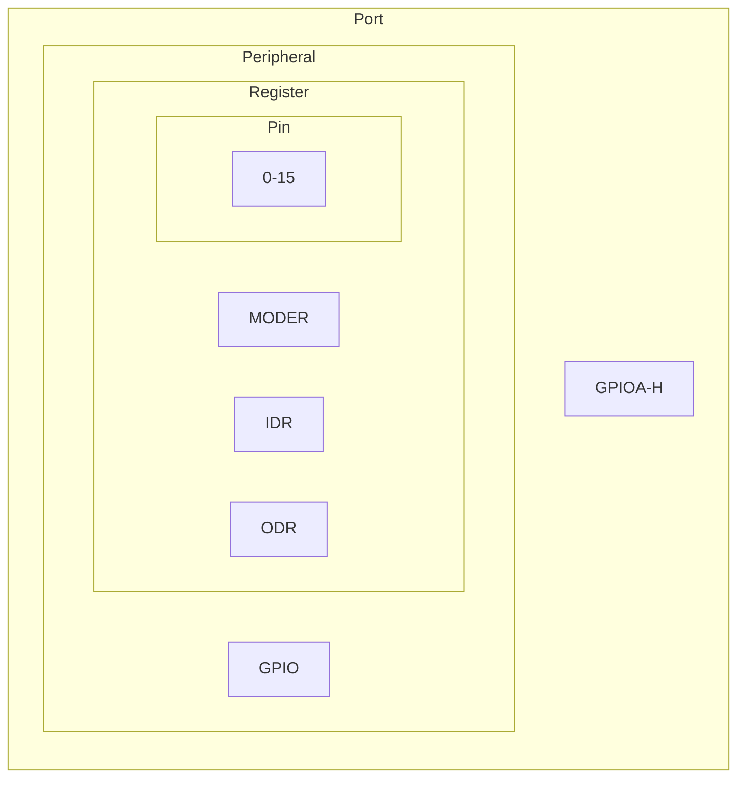

- [Minimal Drivers](#minimal-drivers)
  - [Links](#links)
  - [Microcontrollers layers](#microcontrollers-layers)
  - [Pre-requisites](#pre-requisites)
  - [GPIO](#gpio)
- [Terminology](#terminology)
- [Changelog](#changelog)
  - [L0 Layer - Controller](#l0-layer---controller)
    - [Global](#global)
    - [Utility](#utility)
    - [STM32L475xx](#stm32l475xx)
  - [L2 Layer - Utilities](#l2-layer---utilities)
    - [Own implementation](#own-implementation)
    - [Crates.io](#cratesio)
  - [L3 Layer - Interfaces](#l3-layer---interfaces)
  - [L3 Layer - Drivers](#l3-layer---drivers)
  - [L3 Layer - Miscellaneous](#l3-layer---miscellaneous)
  - [L4 Sensor / Actuator](#l4-sensor--actuator)

# Minimal Drivers

This code has been tested on

- B-L475-IOT01A board (STM32L475VGT6 ARM Cortex M4 CPU with FPU)

## Links

- [Cargo binutils](https://github.com/rust-embedded/cargo-binutils)
- [Embedded Rust book](https://doc.rust-lang.org/stable/embedded-book/)
- [Lowlevel Embedded Rust book](https://docs.rust-embedded.org/embedonomicon/)

## Microcontrollers layers

- L0 Lowlevel
  - CMSIS
  - Controller registers
  - Startup
  - Linker script
- L1 RTOS
- L2 Utility
  - Bitflags
- L3 Driver
  - GPIO
  - UART
- L4 Sensor
- L5 Application

## Pre-requisites

- Pre-requisites from `minimal_controller_peripheral`

## GPIO

- Module
  - Functionality
- Port
  - Registers
- Pin

---

- [GPIO Traits](https://github.com/mbr/gpio-rs)

# Terminology

- Chip
- Controller
- Port
- Peripheral
- Register

# Changelog

## L0 Layer - Controller

### Global

- System Clock
  - Every microcontroller will have a system clock in Hz

### Utility

- Common macros for port and register access
  - `get_port!`
  - `read_register!`
  - `write_register!`

### STM32L475xx

- Controller initialization
  - For now it just updates the System Clock so that it can be used by upper layer (drivers etc)

## L2 Layer - Utilities

### Own implementation

### Crates.io

- [Bitflags](https://github.com/bitflags/bitflags)

## L3 Layer - Interfaces

- GpioIn
- GpioOut
- UsartIn
- UsartOut
- UsartInOut
- Port
  - Generic interface that creates a port using base address and peripheral register layout
  - In C it would be the equivalent of `GPIO_TypeDef * gpio = (GPIO_TypeDef *)BASE_ADDRESS`

## L3 Layer - Drivers

- RCC
- GPIO
  - [x] Input
  - [x] Output
- USART
  - [ ] Read
  - [x] Write

## L3 Layer - Miscellaneous

- Singleton
  - Safe access to global ports

## L4 Sensor / Actuator

- Led
- Button
