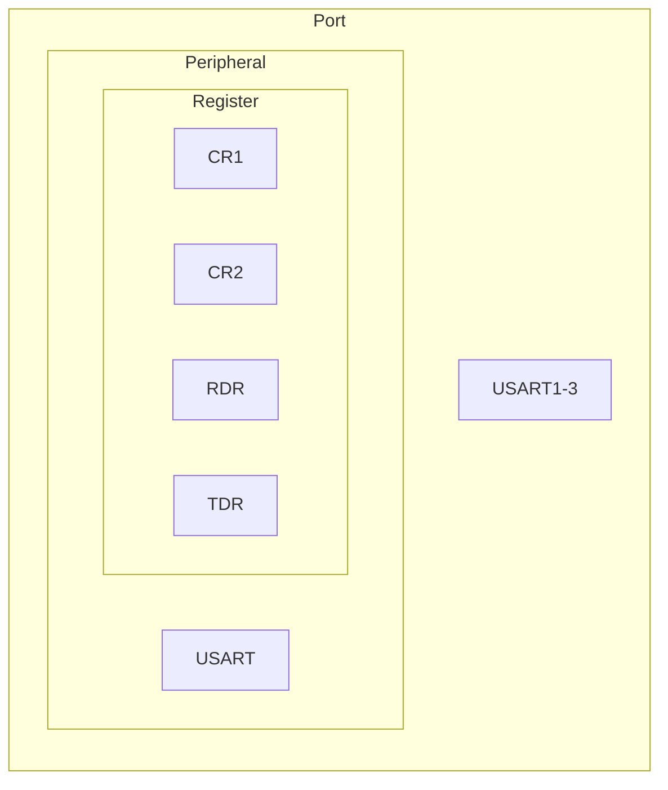
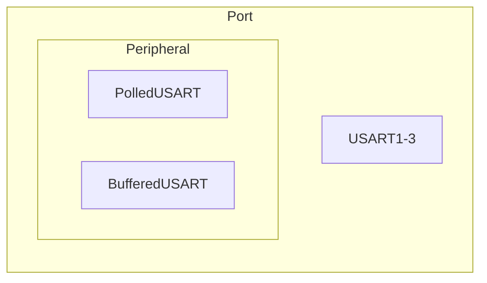

- [Minimal Interrupt](#minimal-interrupt)
  - [Links](#links)
  - [Microcontrollers layers](#microcontrollers-layers)
  - [Pre-requisites](#pre-requisites)
- [Changelog](#changelog)
  - [L0 - Entry](#l0---entry)
  - [L0 - Utility](#l0---utility)
  - [L0 - Chip](#l0---chip)
  - [L0 - Architecture](#l0---architecture)
  - [L2 - Utility](#l2---utility)
  - [L3 Improvements](#l3-improvements)
    - [Hardware](#hardware)
    - [Software](#software)
  - [L3 - Interface](#l3---interface)
  - [L3 - Driver](#l3---driver)
  - [L5 - Application](#l5---application)

# Minimal Interrupt

This code has been tested on

- B-L475-IOT01A board (STM32L475VGT6 ARM Cortex M4 CPU with FPU)

## Links

- [Cargo binutils](https://github.com/rust-embedded/cargo-binutils)
- [Embedded Rust book](https://doc.rust-lang.org/stable/embedded-book/)
- [Lowlevel Embedded Rust book](https://docs.rust-embedded.org/embedonomicon/)

## Microcontrollers layers

- L0 Lowlevel
  - Chip Interrupts
- L1 RTOS
- L2 Utility
  - Heapless library
- L3 Driver
  - Interrupt support for GPIO and USART
- L4 Sensor
- L5 Application
  - Interrupt usage

---

## Pre-requisites

- Pre-requisites from `minimal_driver`

# Changelog

## L0 - Entry

- Updated linker script to remove PROVIDE attributes
- Updated entry point with a better EXCEPTIONS usage

## L0 - Utility

- Added `write_assign_register` macro

## L0 - Chip

- Updated `controller_init` with `SCB->VTOR = FLASH_BASE`
- Added `attach_interrupt_handler` for STM32L475xx chip

## L0 - Architecture

- Added `nvic` module with `enable_irq` function
  - NOTE, This has only been added since bindgen cannot parse `static inline` C functions

## L2 - Utility

- Added [heapless](https://crates.io/crates/heapless) library for stack based datastructures

## L3 Improvements

### Hardware

### Software

## L3 - Interface

- Removed `PeripheralConfiguration` trait
- Added `UsartBufferedIn` and `UsartBufferedInOut` trait

## L3 - Driver

- Added `USARTBufferedFunction` functionality
- Renamed to `USARTPolledFunction`
- Renamed to `GPIOFunction`

## L5 - Application

- Updated example with GPIO Input using interrupt and Atomics
- Updated example with USART Buffered RX and TX using interrupts and static stack allocated lock free queues
